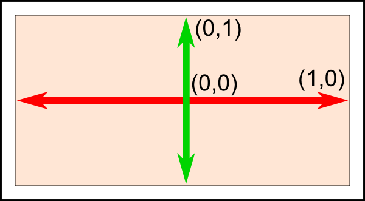
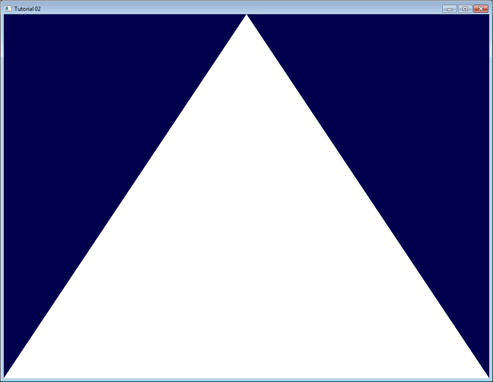
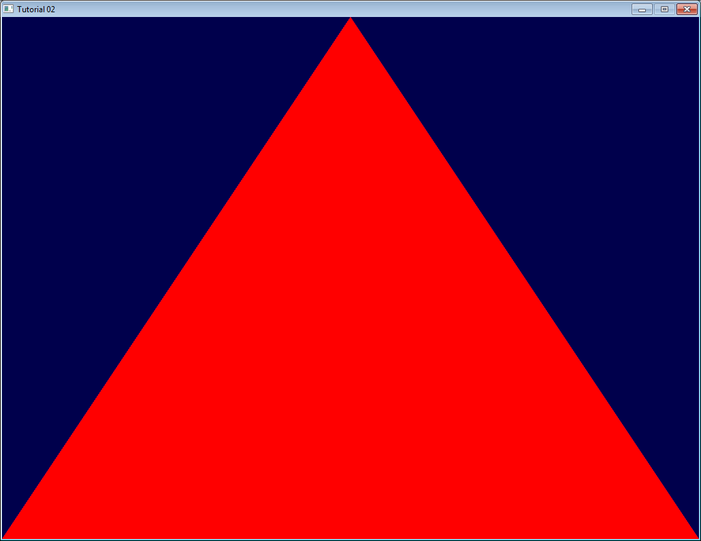

<style>
  h3 {
	margin: 20px 0px 10px 0px;
  }
</style>

免责申明（必读！）：本网站提供的所有教程的翻译原稿均来自于互联网，仅供学习交流之用，切勿进行商业传播。同时，转载时不要移除本申明。如产生任何纠纷，均与本博客所有人、发表该翻译稿之人无任何关系。谢谢合作！

原文链接：[http://www.opengl-tutorial.org/beginners-tutorials/tutorial-2-the-first-triangle/](http://www.opengl-tutorial.org/beginners-tutorials/tutorial-2-the-first-triangle/)

原译文链接: [http://www.opengl-tutorial.org/zh-hans/beginners-tutorials-zh/tutorial-2-the-first-triangle-zh/](http://www.opengl-tutorial.org/zh-hans/beginners-tutorials-zh/tutorial-2-the-first-triangle-zh/)

##第二课： 画第一个三角形

这将又是一篇长教程。

用OpenGL 3实现复杂的东西很方便；为此付出的代价是，画一个简单的三角形变得比较麻烦。

不要忘了，定期复制粘贴，跑一下代码。

`如果程序启动时崩溃了，很可能是你从错误的目录下运行了它。请仔细地阅读第一课中讲到的如何配置Visual Studio！`

###顶点数组对象(VAO)

你需要创建一个顶点数组对象，并将它设为当前对象（细节暂不深入）：

```cpp
GLuint VertexArrayID;
glGenVertexArrays(1, &VertexArrayID);
glBindVertexArray(VertexArrayID);
```
当窗口创建成功后（即OpenGL上下文创建后），马上做这一步工作；必须在任何其他OpenGL调用前完成。

若想进一步了解顶点数组对象（VAO），可以参考其他教程；但这不是很重要。

###屏幕坐标系

三点定义一个三角形。当我们在三维图形学中谈论“点（point）”时，我们经常说“顶点（Vertex）”。一个顶点有三个坐标：X，Y和Z。你可以用以下方式来想象这三个坐标：

X 在你的右方
Y 在你的上方
Z 是你背后的方向（是的，背后，而不是你的前方）
这里有一个更形象的方法：使用右手定则

X 是你的拇指
Y 是你的食指
Z 是你的中指。如果你把你的拇指指向右边，食指指向天空，那么中指将指向你的背后。
让Z指往这个方向很奇怪，为什么要这样呢？简单的说：因为基于右手定则的坐标系被广泛使用了100多年，它会给你很多有用的数学工具；而唯一的缺点只是Z方向不直观。

`补充：`注意，你可以自由地移动你的手：你的X，Y和Z轴也将跟着移动（详见后文）。

我们需要三个三维点来组成一个三角形；现在开始：

```cpp
// An array of 3 vectors which represents 3 vertices
static const GLfloat g_vertex_buffer_data[] = {
   -1.0f, -1.0f, 0.0f,
   1.0f, -1.0f, 0.0f,
   0.0f,? 1.0f, 0.0f,
};
```

第一个顶点是(-1, -1, 0)。

这意味着除非我们以某种方式变换它，否则它将显示在屏幕的(-1, -1)位置。什么意思呢？屏幕的原点在中间，X在右方，Y在上方。屏幕坐标如下图：



该机制内置于显卡，无法改变。因此(-1, -1)是屏幕的左下角，(1, -1)是右下角，(0, 1)在中上位置。这个三角形应该占满了大部分屏幕。

###画我们的三角形

下一步把这个三角形传给OpenGL。我们通过创建一个缓冲区完成：

```cpp
// This will identify our vertex buffer
GLuint vertexbuffer;

// Generate 1 buffer, put the resulting identifier in vertexbuffer
glGenBuffers(1, &vertexbuffer);

// The following commands will talk about our 'vertexbuffer' buffer
glBindBuffer(GL_ARRAY_BUFFER, vertexbuffer);

// Give our vertices to OpenGL.
glBufferData(GL_ARRAY_BUFFER, sizeof(g_vertex_buffer_data), g_vertex_buffer_data, GL_STATIC_DRAW);
```

这只要做一次。

现在，我们的主循环中，那个之前啥都没有的地方，就能画我们宏伟的三角形了：

```cpp
// 1rst attribute buffer : vertices
glEnableVertexAttribArray(0);
glBindBuffer(GL_ARRAY_BUFFER, vertexbuffer);
glVertexAttribPointer(
   0,                  // attribute 0. No particular reason for 0, but must match the layout in the shader.
   3,                  // size
   GL_FLOAT,           // type
   GL_FALSE,           // normalized?
   0,                  // stride
   (void*)0            // array buffer offset
);

// Draw the triangle !
glDrawArrays(GL_TRIANGLES, 0, 3); // Starting from vertex 0; 3 vertices total -> 1 triangle

glDisableVertexAttribArray(0);
```

结果如图：



白色略显无聊。让我们来看看怎么把它涂成红色。这就需要用到一个叫『着色器（Shader）』的东西。

###着色器

####编译着色器

在最简单的配置下，你将需要两个着色器：一个叫顶点着色器，它将作用于每个顶点上；另一个叫片断（Fragment）着色器，它将作用于每一个采样点。我们使用4倍反走样，因此每像素有四个采样点。

着色器编程使用GLSL(GL Shader Language，GL着色语言)，它是OpenGL的一部分。与C或Java不同，GLSL必须在运行时编译，这意味着每次启动程序，所有的着色器将重新编译。

这两个着色器通常放在单独的文件里。本例中，我们有SimpleFragmentShader.fragmentshader和SimpleVertexShader.vertexshader两个着色器。他们的扩展名是无关紧要的，可以是.txt或者.glsl。

以下是代码。完全理解它不是很重要，因为通常一个程序只做一次，看懂注释就够了。所有其他课程代码都用到了这个函数，所以它被放在一个单独的文件中：common/loadShader.cpp。注意，和缓冲区一样，着色器不能直接访问：我们仅仅有一个编号（ID）。真正的实现隐藏在驱动程序中。

```cpp
GLuint LoadShaders(const char * vertex_file_path,const char * fragment_file_path){

    // Create the shaders
    GLuint VertexShaderID = glCreateShader(GL_VERTEX_SHADER);
    GLuint FragmentShaderID = glCreateShader(GL_FRAGMENT_SHADER);

    // Read the Vertex Shader code from the file
    std::string VertexShaderCode;
    std::ifstream VertexShaderStream(vertex_file_path, std::ios::in);
    if(VertexShaderStream.is_open())
    {
        std::string Line = "";
        while(getline(VertexShaderStream, Line))
            VertexShaderCode += "\n" + Line;
        VertexShaderStream.close();
    }

    // Read the Fragment Shader code from the file
    std::string FragmentShaderCode;
    std::ifstream FragmentShaderStream(fragment_file_path, std::ios::in);
    if(FragmentShaderStream.is_open()){
        std::string Line = "";
        while(getline(FragmentShaderStream, Line))
            FragmentShaderCode += "\n" + Line;
        FragmentShaderStream.close();
    }

    GLint Result = GL_FALSE;
    int InfoLogLength;

    // Compile Vertex Shader
    printf("Compiling shader : %s\n", vertex_file_path);
    char const * VertexSourcePointer = VertexShaderCode.c_str();
    glShaderSource(VertexShaderID, 1, &VertexSourcePointer , NULL);
    glCompileShader(VertexShaderID);

    // Check Vertex Shader
    glGetShaderiv(VertexShaderID, GL_COMPILE_STATUS, &Result);
    glGetShaderiv(VertexShaderID, GL_INFO_LOG_LENGTH, &InfoLogLength);
    std::vector VertexShaderErrorMessage(InfoLogLength);
    glGetShaderInfoLog(VertexShaderID, InfoLogLength, NULL, &VertexShaderErrorMessage[0]);
    fprintf(stdout, "%s\n", &VertexShaderErrorMessage[0]);

    // Compile Fragment Shader
    printf("Compiling shader : %s\n", fragment_file_path);
    char const * FragmentSourcePointer = FragmentShaderCode.c_str();
    glShaderSource(FragmentShaderID, 1, &FragmentSourcePointer , NULL);
    glCompileShader(FragmentShaderID);

    // Check Fragment Shader
    glGetShaderiv(FragmentShaderID, GL_COMPILE_STATUS, &Result);
    glGetShaderiv(FragmentShaderID, GL_INFO_LOG_LENGTH, &InfoLogLength);
    std::vector FragmentShaderErrorMessage(InfoLogLength);
    glGetShaderInfoLog(FragmentShaderID, InfoLogLength, NULL, &FragmentShaderErrorMessage[0]);
    fprintf(stdout, "%s\n", &FragmentShaderErrorMessage[0]);

    // Link the program
    fprintf(stdout, "Linking programn");
    GLuint ProgramID = glCreateProgram();
    glAttachShader(ProgramID, VertexShaderID);
    glAttachShader(ProgramID, FragmentShaderID);
    glLinkProgram(ProgramID);

    // Check the program
    glGetProgramiv(ProgramID, GL_LINK_STATUS, &Result);
    glGetProgramiv(ProgramID, GL_INFO_LOG_LENGTH, &InfoLogLength);
    std::vector ProgramErrorMessage( max(InfoLogLength, int(1)) );
    glGetProgramInfoLog(ProgramID, InfoLogLength, NULL, &ProgramErrorMessage[0]);
    fprintf(stdout, "%s\n", &ProgramErrorMessage[0]);

    glDeleteShader(VertexShaderID);
    glDeleteShader(FragmentShaderID);

    return ProgramID;
}
```

####我们的顶点着色器

我们先写顶点着色器。

第一行告诉编译器我们将用OpenGL 3的语法。

```cpp
#version 330 core
```

第二行声明输入数据：

```cpp
layout(location = 0) in vec3 vertexPosition_modelspace;
```

具体解释一下这一行：

“vec3”在GLSL中是一个三维向量。类似于（但不相同）以前我们用来声明三角形的glm::vec3。最重要的是，如果我们在C++中使用三维向量，那么在GLSL中也使用三维向量。

“layout(location = 0)”指我们用来赋给vertexPosition_modelspace这个属性的缓冲区。每个顶点能有多种属性：位置，一种或多种颜色，一个或多个纹理坐标，等等。OpenGL不知道什么是颜色：它只是看到一个vec3。因此我们必须告诉它，哪个缓冲对应哪个输入。通过将glvertexAttribPointer函数的第一个参数值赋给layout，我们就完成了这一点。参数值“0”并不重要，它可以是12（但是不大于glGetIntegerv(GL_MAX_VERTEX_ATTRIBS, &v)）；重要的是两边参数值保持一致。

“vertexPosition_modelspace”这个变量名你可以任取，它将包含每个顶点着色器运行所需的顶点位置值。

“in”的意思是这是一些输入数据。不久我们将会看到“out”关键词。

每个顶点都会调用main函数（和C语言一样）：

```cpp
void main(){
```

我们的main函数只是将顶点的位置设为缓冲区里的值，无论这值是多少。因此如果我们给出位置（1,1），那么三角形将有一个顶点在屏幕的右上角。
在下一课中我们将看到，怎样对输入位置做一些更有趣的计算。

```cpp
    gl_Position.xyz = vertexPosition_modelspace;
    gl_Position.w = 1.0;
}
```

gl_Position是为数不多的内置变量之一：你必须赋一个值给它。其他操作都是可选的，我们将在第四课中看到“其他操作”指的是什么。

####我们的片断着色器

作为我们的第一个片断着色器，我们只做一个简单的事：设置每个片断的颜色为红色。（记住，每像素有4个片断，因为我们用的是4倍反走样）

```cpp
out vec3 color;

void main(){
    color = vec3(1,0,0);
}
```

vec3(1,0,0)代表红色。因为在计算机屏幕上，颜色由红，绿，蓝这个顺序三元组表示。因此（1,0,0）意思是全红，没有绿色，也没有蓝色。

###把它们组合起来

在main循环前，调用我们的LoadShaders函数：

```cpp
// Create and compile our GLSL program from the shaders
GLuint programID = LoadShaders( "SimpleVertexShader.vertexshader", "SimpleFragmentShader.fragmentshader" );
```

现在在main循环中，首先清屏：

```cpp
glClear(GL_COLOR_BUFFER_BIT | GL_DEPTH_BUFFER_BIT);
```

然后告诉OpenGL你想用你的着色器：

```cpp
// Use our shader
glUseProgram(programID);

// Draw triangle...
```

…接着转眼间，这就是你的红色三角形！



下一课中我们将学习变换：如何设置你的相机，移动物体等等。

`教程看不懂？教程不够详细？有错别字？` [请点击这里提交问题，我们一定会竭诚为您服务！](https://github.com/andyque/opengl-tutorials/issues/new)
