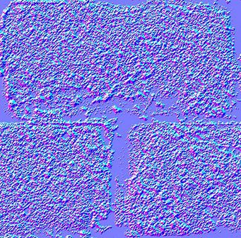
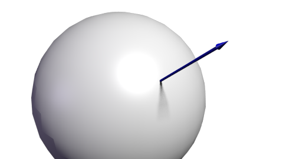
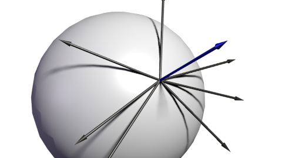
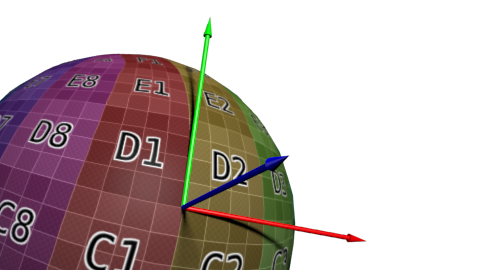
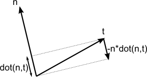
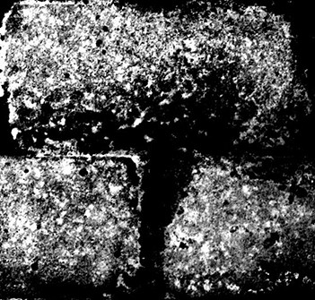
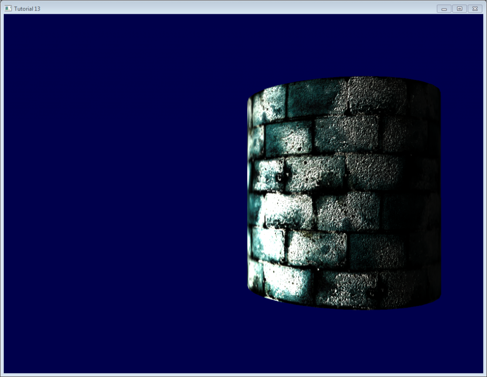
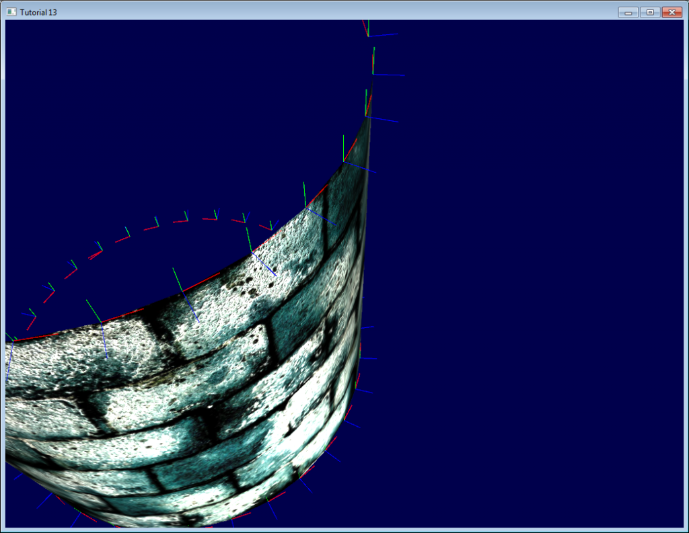
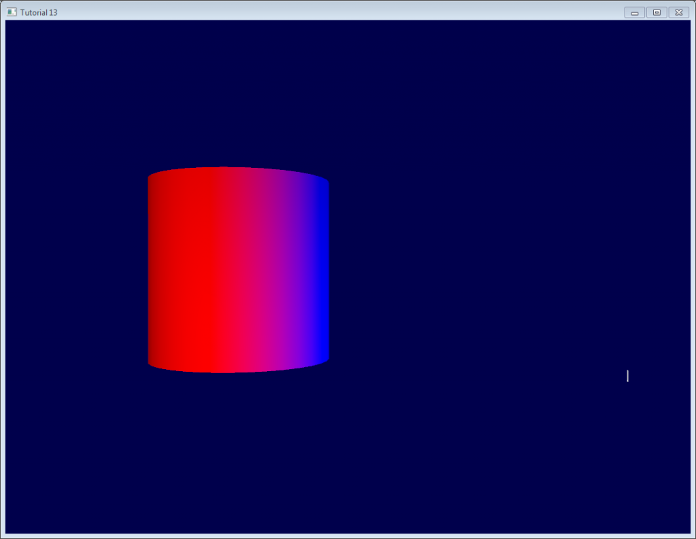

<style>
  h3 {
	margin: 20px 0px 10px 0px;
  }
</style>

免责申明（必读！）：本网站提供的所有教程的翻译原稿均来自于互联网，仅供学习交流之用，切勿进行商业传播。同时，转载时不要移除本申明。如产生任何纠纷，均与本博客所有人、发表该翻译稿之人无任何关系。谢谢合作！

原文链接：[http://www.opengl-tutorial.org/intermediate-tutorials/tutorial-12-opengl-extensions/](http://www.opengl-tutorial.org/intermediate-tutorials/tutorial-12-opengl-extensions/)

原译文链接: [https://github.com/cybercser/OpenGL_3_3_Tutorial_Translation/blob/master/Tutorial%2013%20Normal%20Mapping%20opengl-tutorial.org.md](https://github.com/cybercser/OpenGL_3_3_Tutorial_Translation/blob/master/Tutorial%2013%20Normal%20Mapping%20opengl-tutorial.org.md)

第十三课：法线贴图
==

欢迎来到第十三课！今天讲法线贴图（normal mapping）。


学完[第八课：基本光照模型](http://www.opengl-tutorial.org/beginners-tutorials/tutorial-8-basic-shading/)后，我们知道了如何用三角形法线得到不错的光照效果。需要注意的是，截至目前，每个顶点仅有一个法线：在三角形三个顶点间，法线是平滑过渡的；而颜色（纹理的采样）恰与此相反。

法线纹理
---
法线纹理看起来像这样：



每个纹素的RGB值实际上表示的是XYZ向量：颜色的分量取值范围为0到1，而向量的分量取值范围是-1到1；可以建立从纹素到法线的简单映射：
```cpp
normal = (2*color)-1 // on each component
```
法线纹理整体呈蓝色，因为法线基本是朝上的（上方即Z轴正向。OpenGL中Y轴=上，有所不同。这种不兼容很蠢，但没人想为此重写现有的工具，我们将就用吧。后面介绍详情。）

法线纹理的映射方式和颜色纹理相似。麻烦的是如何将法线从各三角形局部坐标系（切线坐标系tangent space，亦称图像坐标系image space）变换到模型坐标系（计算光照采用的坐标系）。

切线和双切线（Tangent and Bitangent）
---
想必大家对矩阵已经十分熟悉了；大家知道，定义一个坐标系（本例是切线坐标系）需要三个向量。现在Up向量已经有了，即法线：可用Blender计算，或做一个简单的叉乘。下图中蓝色箭头代表法线（法线贴图整体颜色也恰好是蓝色）。



然后是切线T：垂直于平面的向量。切线有很多个：



这么多切线中该选哪一个呢？理论上，任何一个都可以。不过我们得和相邻顶点保持一致，以免导致边缘出现瑕疵。一个通行的办法是将切线方向和纹理坐标系对齐：


定义一组基需要三个向量，因此我们还得计算双切线B（本来可以随便选一条切线，但选定垂直于其他两条轴的切线，计算会方便些）。



算法如下：若把三角形的两条边记为`deltaPos1`和`deltaPos2`，`deltaUV1`和`deltaUV2`是对应的UV坐标下的差值；此问题可用如下方程表示：
```
deltaPos1 = deltaUV1.x * T + deltaUV1.y * B
deltaPos2 = deltaUV2.x * T + deltaUV2.y * B
```
求解T和B就得到了切线和双切线！（代码见下文）

已知T、B、N向量之后，即可得下面这个漂亮的矩阵，完成从模型坐标系到切线坐标系的变换：


有了TBN矩阵，我们就能把法线（从法线纹理中提取而来）变换到模型坐标系。

可我们需要的却是与之相反的变换：从切线坐标系到模型坐标系，法线保持不变。所有计算均在切线坐标系中进行，不会对其他计算产生影响。

既然要进行逆向的变换，那只需对以上矩阵求逆即可。这个矩阵（正交阵，即各向量相互正交，请看后面“延伸阅读”小节）的逆矩阵恰好也就是其转置矩阵，计算十分简单：
```
invTBN = transpose(TBN)
```
亦即：


准备VBO
---
###计算切线和双切线###
我们需要为整个模型计算切线、双切线和法线。用一个单独的函数完成这项工作：
```cpp
void computeTangentBasis(
    // inputs
    std::vector<glm::vec3> & vertices,
    std::vector<glm::vec2> & uvs,
    std::vector<glm::vec3> & normals,
    // outputs
    std::vector<glm::vec3> & tangents,
    std::vector<glm::vec3> & bitangents
){
```
为每个三角形计算边（`deltaPos`）和`deltaUV`
```cpp
    for ( int i=0; i<vertices.size(); i+=3){

        // Shortcuts for vertices
        glm::vec3 & v0 = vertices[i+0];
        glm::vec3 & v1 = vertices[i+1];
        glm::vec3 & v2 = vertices[i+2];

        // Shortcuts for UVs
        glm::vec2 & uv0 = uvs[i+0];
        glm::vec2 & uv1 = uvs[i+1];
        glm::vec2 & uv2 = uvs[i+2];

        // Edges of the triangle : postion delta
        glm::vec3 deltaPos1 = v1-v0;
        glm::vec3 deltaPos2 = v2-v0;

        // UV delta
        glm::vec2 deltaUV1 = uv1-uv0;
        glm::vec2 deltaUV2 = uv2-uv0;
```
现在用公式来算切线和双切线：
```cpp
        float r = 1.0f / (deltaUV1.x * deltaUV2.y - deltaUV1.y * deltaUV2.x);
        glm::vec3 tangent = (deltaPos1 * deltaUV2.y   - deltaPos2 * deltaUV1.y)*r;
        glm::vec3 bitangent = (deltaPos2 * deltaUV1.x   - deltaPos1 * deltaUV2.x)*r;
```
最后，把这些*切线*和*双切线*缓存到数组。记住，还没为这些缓存的数据生成索引，因此每个顶点都有一份拷贝。
```cpp
        // Set the same tangent for all three vertices of the triangle.
        // They will be merged later, in vboindexer.cpp
        tangents.push_back(tangent);
        tangents.push_back(tangent);
        tangents.push_back(tangent);

        // Same thing for binormals
        bitangents.push_back(bitangent);
        bitangents.push_back(bitangent);
        bitangents.push_back(bitangent);

    }
```

###生成索引###
索引VBO的方法和之前类似，仅有些许不同。

若找到一个相似顶点（相同的坐标、法线、纹理坐标），我们不使用它的切线、次法线；反而要取其均值。因此，只需把旧代码修改一下：
```cpp
        // Try to find a similar vertex in out_XXXX
        unsigned int index;
        bool found = getSimilarVertexIndex(in_vertices[i], in_uvs[i], in_normals[i],     out_vertices, out_uvs, out_normals, index);

        if ( found ){ // A similar vertex is already in the VBO, use it instead !
            out_indices.push_back( index );

            // Average the tangents and the bitangents
            out_tangents[index] += in_tangents[i];
            out_bitangents[index] += in_bitangents[i];
        }else{ // If not, it needs to be added in the output data.
            // Do as usual
            [...]
        }
```
注意，这里没做规范化。这样做很讨巧，因为小三角形的切线、双切线向量也小；相对于大三角形（对最终形状影响较大），对最终结果的影响力也就小。

Shader
---
新增的缓冲区和uniform变量
---
新加上两个缓冲区：分别存放切线和双切线：
```cpp
    GLuint tangentbuffer;
    glGenBuffers(1, &tangentbuffer);
    glBindBuffer(GL_ARRAY_BUFFER, tangentbuffer);
    glBufferData(GL_ARRAY_BUFFER, indexed_tangents.size() * sizeof(glm::vec3), &indexed_tangents[0], GL_STATIC_DRAW);

    GLuint bitangentbuffer;
    glGenBuffers(1, &bitangentbuffer);
    glBindBuffer(GL_ARRAY_BUFFER, bitangentbuffer);
    glBufferData(GL_ARRAY_BUFFER, indexed_bitangents.size() * sizeof(glm::vec3), &indexed_bitangents[0], GL_STATIC_DRAW);
```
还需要一个uniform变量存储新的法线纹理：
```cpp
    [...]
    GLuint NormalTexture = loadTGA_glfw("normal.tga");
    [...]
    GLuint NormalTextureID  = glGetUniformLocation(programID, "NormalTextureSampler");
```
另外一个uniform变量存储3x3的模型视图矩阵。严格地讲，这个矩阵不必要，但有它更方便；详见后文。由于仅仅计算旋转，不需要位移，因此只需矩阵左上角3x3的部分。
```cpp
    GLuint ModelView3x3MatrixID = glGetUniformLocation(programID, "MV3x3");
```
完整的绘制代码如下：
```cpp
        // Clear the screen
        glClear(GL_COLOR_BUFFER_BIT | GL_DEPTH_BUFFER_BIT);

        // Use our shader
        glUseProgram(programID);

        // Compute the MVP matrix from keyboard and mouse input
        computeMatricesFromInputs();
        glm::mat4 ProjectionMatrix = getProjectionMatrix();
        glm::mat4 ViewMatrix = getViewMatrix();
        glm::mat4 ModelMatrix = glm::mat4(1.0);
        glm::mat4 ModelViewMatrix = ViewMatrix * ModelMatrix;
        glm::mat3 ModelView3x3Matrix = glm::mat3(ModelViewMatrix); // Take the upper-left part of ModelViewMatrix
        glm::mat4 MVP = ProjectionMatrix * ViewMatrix * ModelMatrix;

        // Send our transformation to the currently bound shader,
        // in the "MVP" uniform
        glUniformMatrix4fv(MatrixID, 1, GL_FALSE, &MVP[0][0]);
        glUniformMatrix4fv(ModelMatrixID, 1, GL_FALSE, &ModelMatrix[0][0]);
        glUniformMatrix4fv(ViewMatrixID, 1, GL_FALSE, &ViewMatrix[0][0]);
        glUniformMatrix4fv(ViewMatrixID, 1, GL_FALSE, &ViewMatrix[0][0]);
        glUniformMatrix3fv(ModelView3x3MatrixID, 1, GL_FALSE, &ModelView3x3Matrix[0][0]);

        glm::vec3 lightPos = glm::vec3(0,0,4);
        glUniform3f(LightID, lightPos.x, lightPos.y, lightPos.z);

        // Bind our diffuse texture in Texture Unit 0
        glActiveTexture(GL_TEXTURE0);
        glBindTexture(GL_TEXTURE_2D, DiffuseTexture);
        // Set our "DiffuseTextureSampler" sampler to user Texture Unit 0
        glUniform1i(DiffuseTextureID, 0);

        // Bind our normal texture in Texture Unit 1
        glActiveTexture(GL_TEXTURE1);
        glBindTexture(GL_TEXTURE_2D, NormalTexture);
        // Set our "Normal    TextureSampler" sampler to user Texture Unit 0
        glUniform1i(NormalTextureID, 1);

        // 1rst attribute buffer : vertices
        glEnableVertexAttribArray(0);
        glBindBuffer(GL_ARRAY_BUFFER, vertexbuffer);
        glVertexAttribPointer(
            0,                  // attribute
            3,                  // size
            GL_FLOAT,           // type
            GL_FALSE,           // normalized?
            0,                  // stride
            (void*)0            // array buffer offset
        );

        // 2nd attribute buffer : UVs
        glEnableVertexAttribArray(1);
        glBindBuffer(GL_ARRAY_BUFFER, uvbuffer);
        glVertexAttribPointer(
            1,                                // attribute
            2,                                // size
            GL_FLOAT,                         // type
            GL_FALSE,                         // normalized?
            0,                                // stride
            (void*)0                          // array buffer offset
        );

        // 3rd attribute buffer : normals
        glEnableVertexAttribArray(2);
        glBindBuffer(GL_ARRAY_BUFFER, normalbuffer);
        glVertexAttribPointer(
            2,                                // attribute
            3,                                // size
            GL_FLOAT,                         // type
            GL_FALSE,                         // normalized?
            0,                                // stride
            (void*)0                          // array buffer offset
        );

        // 4th attribute buffer : tangents
        glEnableVertexAttribArray(3);
        glBindBuffer(GL_ARRAY_BUFFER, tangentbuffer);
        glVertexAttribPointer(
            3,                                // attribute
            3,                                // size
            GL_FLOAT,                         // type
            GL_FALSE,                         // normalized?
            0,                                // stride
            (void*)0                          // array buffer offset
        );

        // 5th attribute buffer : bitangents
        glEnableVertexAttribArray(4);
        glBindBuffer(GL_ARRAY_BUFFER, bitangentbuffer);
        glVertexAttribPointer(
            4,                                // attribute
            3,                                // size
            GL_FLOAT,                         // type
            GL_FALSE,                         // normalized?
            0,                                // stride
            (void*)0                          // array buffer offset
        );

        // Index buffer
        glBindBuffer(GL_ELEMENT_ARRAY_BUFFER, elementbuffer);

        // Draw the triangles !
        glDrawElements(
            GL_TRIANGLES,      // mode
            indices.size(),    // count
            GL_UNSIGNED_INT,   // type
            (void*)0           // element array buffer offset
        );

        glDisableVertexAttribArray(0);
        glDisableVertexAttribArray(1);
        glDisableVertexAttribArray(2);
        glDisableVertexAttribArray(3);
        glDisableVertexAttribArray(4);

        // Swap buffers
        glfwSwapBuffers();
```
###Vertex shader###

和前面讲的一样，所有计算都在观察坐标系中做，因为在这获取片断坐标更容易。这就是为什么要用模型视图矩阵乘T、B、N向量。
```glsl
    vertexNormal_cameraspace = MV3x3 * normalize(vertexNormal_modelspace);
    vertexTangent_cameraspace = MV3x3 * normalize(vertexTangent_modelspace);
    vertexBitangent_cameraspace = MV3x3 * normalize(vertexBitangent_modelspace);
```
这三个向量确定了TBN矩阵，其创建方式如下：
```glsl
    mat3 TBN = transpose(mat3(
        vertexTangent_cameraspace,
        vertexBitangent_cameraspace,
        vertexNormal_cameraspace
    )); // You can use dot products instead of building this matrix and transposing it. See References for details.
```
此矩阵是从观察坐标系到切线坐标系的变换（若有一矩阵名为`XXX_modelspace`，则它执行的是从模型坐标系到切线坐标系的变换）。可以利用它计算切线坐标系中的光线方向和视线方向。
```glsl
    LightDirection_tangentspace = TBN * LightDirection_cameraspace;
    EyeDirection_tangentspace =  TBN * EyeDirection_cameraspace;
```

###Fragment shader###
切线坐标系中的法线很容易获取：就在纹理中：
```glsl
    // Local normal, in tangent space
    vec3 TextureNormal_tangentspace = normalize(texture2D( NormalTextureSampler, UV ).rgb*2.0 - 1.0);
```

一切准备就绪。漫反射光的值由切线坐标系中的n和l计算得来（在哪个坐标系中计算并不重要，重要的是n和l必须位于同一坐标系中），再用*clamp( dot( n,l ), 0,1 )*截断。镜面光用*clamp( dot( E,R ), 0,1 )*截断，E和R也必须位于同一坐标系中。搞定！S

结果
---
这是目前得到的结果，可以看到：

- 砖块看上去凹凸不平，这是因为砖块表面法线变化比较剧烈
- 水泥部分看上去很平整，这是因为这部分的法线纹理都是整齐的蓝色


延伸阅读
---
###正交化（Orthogonalization）###
Vertex shader中，为了计算得更快，我们没有用矩阵求逆，而是进行了转置。这只有当矩阵表示的坐标系是正交的时候才成立，而眼前这个矩阵还不是正交的。幸运的是这个问题很容易解决：只需在`computeTangentBasis()`末尾让切线与法线垂直。I
```cpp
t = glm::normalize(t - n * glm::dot(n, t));
```
这个公式有点难理解，来看看图：



n和t差不多是相互垂直的，只要把`t`沿`-n`方向稍微“压”一下，这个幅度是`dot(n,t)`。
[这里](http://www.cse.illinois.edu/iem/least_squares/gram_schmidt/)有一个applet也讲得很清楚（仅含两个向量）

###左手坐标系还是右手坐标系？###
一般不必担心这个问题。但在某些情况下，比如使用对称模型时，UV坐标方向是错的，导致切线T方向错误。

检查是否需要翻转这些方向很容易：TBN必须形成一个右手坐标系，即，向量`cross(n,t)`应该和b同向。

用数学术语讲，“向量A和向量B同向”就是“`dot(A,B)>0`”；故只需检查`dot( cross(n,t) , b )`是否大于0。

若`dot( cross(n,t) , b ) < 0`，就要翻转`t`：
```cpp
if (glm::dot(glm::cross(n, t), b) < 0.0f){
    t = t * -1.0f;
 }
```
在`computeTangentBasis()`末对每个顶点都做这个操作。

###高光纹理（Specular texture）###
纯粹出于乐趣，我在代码里加上了高光纹理；取代了原先作为高光颜色的灰色`vec3(0.3,0.3,0.3)`，现在看起来像这样：






注意，现在水泥部分始终是黑色的：因为高光纹理中，其高光分量为0。

###用立即模式进行调试###
本站的初衷是让大家**不再**使用过时、缓慢、问题频出的立即模式。

不过，用立即模式进行调试却十分方便：



这里，我们在立即模式下画了一些线条表示切线坐标系。

要进入立即模式，得关闭3.3 Core Profile：
```cpp
glfwOpenWindowHint(GLFW_OPENGL_PROFILE, GLFW_OPENGL_COMPAT_PROFILE);
```
然后把矩阵传给旧式的OpenGL流水线（你也可以另写一个着色器，不过这样做更简单，反正都是在hacking）：
```cpp
glMatrixMode(GL_PROJECTION);
glLoadMatrixf((const GLfloat*)&ProjectionMatrix[0]);
glMatrixMode(GL_MODELVIEW);
glm::mat4 MV = ViewMatrix * ModelMatrix;
glLoadMatrixf((const GLfloat*)&MV[0]);
```
禁用着色器：
```cpp
glUseProgram(0);
```
然后画线条（本例中法线都已被归一化，乘了0.1，放到了对应顶点上）：
```cpp
glColor3f(0,0,1);
glBegin(GL_LINES);
for (int i=0; i<indices.size(); i++){
    glm::vec3 p = indexed_vertices[indices[i]];
    glVertex3fv(&p.x);
    glm::vec3 o = glm::normalize(indexed_normals[indices[i]]);
    p+=o*0.1f;
    glVertex3fv(&p.x);
}
glEnd();
```
记住：实际项目中不要用立即模式！只在调试时用！别忘了之后恢复到Core Profile，它可以保证不会启用立即模式！

###用颜色进行调试###
调试时，将向量的值可视化很有用。最简单的方法是把向量都写到帧缓冲区。举个例子，我们把`LightDirection_tangentspace`可视化一下试试
```cpp
color.xyz = LightDirection_tangentspace;
```


这说明：

- 在圆柱体的右侧，光线（如白色线条所示）是朝上（在切线坐标系中）的。也就是说，光线和三角形的法线同向。
	
- 在圆柱体的中间部分，光线和切线方向（指向+X）同向。

友情提示：

- 可视化前，变量是否需要规范化？这取决于具体情况。
- 如果结果不好看懂，就逐分量地可视化。比如，只观察红色，而将绿色和蓝色分量强制设为0。
- 别折腾alpha值，太复杂了>
- 若想将一个负值可视化，可以采用和处理法线纹理一样的技巧：转而把`(v+1.0)/2.0`可视化，于是黑色就代表-1，而白色代表+1。只不过这样做有点绕弯子。

###用变量名进行调试###
前面已经讲过了，搞清楚向量所处的坐标系至关重要。千万别把一个观察坐标系里的向量和一个模型坐标系里的向量做点乘。

给向量名称添加后缀“\_modelspace”可以有效地避免这类计算错误。

###怎样制作法线贴图###
作者James O’Hare。点击图片放大。


练习
---
- 在`indexVBO_TBN`函数中，在做加法前把向量归一化，看看结果。
- 用颜色可视化其他向量（如`instance`、`EyeDirection_tangentspace`），试着解释你看到的结果。

工具和链接
---
- [Crazybump](http://www.crazybump.com/) 制作法线纹理的好工具，收费。
- [Nvidia photoshop插件](http://developer.nvidia.com/nvidia-texture-tools-adobe-photoshop)免费，不过Photoshop不免费……
- [用多幅照片制作法线贴图](http://www.zarria.net/nrmphoto/nrmphoto.html)
- [用单幅照片制作法线贴图](http://www.katsbits.com/tutorials/textures/making-normal-maps-from-photographs.php)
- 关于[矩阵转置](http://www.katjaas.nl/transpose/transpose.html)的详细资料

参考文献
---
- [Lengyel, Eric. “Computing Tangent Space Basis Vectors for an Arbitrary Mesh”. Terathon Software 3D Graphics Library, 2001.](http://www.terathon.com/code/tangent.html)
- [Real Time Rendering, third edition](http://www.amazon.com/dp/1568814240)
- [ShaderX4](http://www.amazon.com/dp/1584504250)


`教程看不懂？教程不够详细？有错别字？` [请点击这里提交问题，我们一定会竭诚为您服务！](https://github.com/andyque/opengl-tutorials/issues/new)
