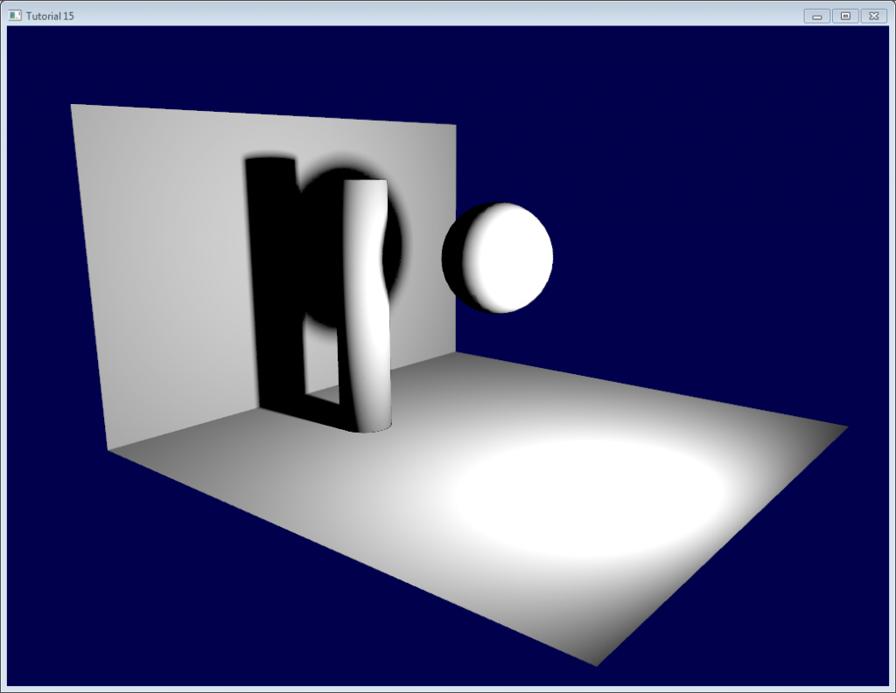
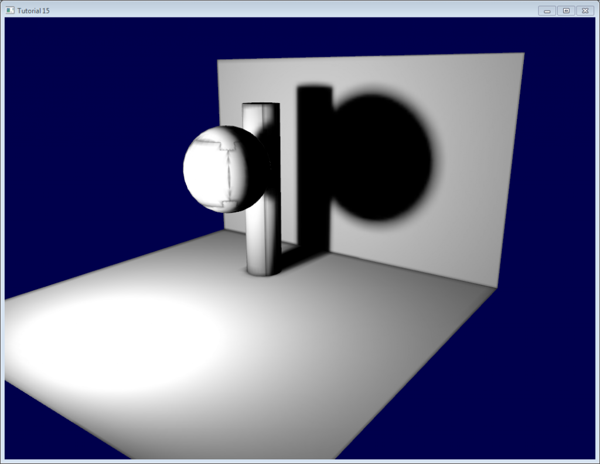

<style>
  h3 {
	margin: 20px 0px 10px 0px;
  }
</style>

免责申明（必读！）：本网站提供的所有教程的翻译原稿均来自于互联网，仅供学习交流之用，切勿进行商业传播。同时，转载时不要移除本申明。如产生任何纠纷，均与本博客所有人、发表该翻译稿之人无任何关系。谢谢合作！

原文链接：[http://www.opengl-tutorial.org/intermediate-tutorials/tutorial-12-opengl-extensions/](http://www.opengl-tutorial.org/intermediate-tutorials/tutorial-12-opengl-extensions/)

原译文链接: [https://github.com/cybercser/OpenGL_3_3_Tutorial_Translation/blob/master/Tutorial%2015%20Lightmaps%20opengl-toturial.org.md](https://github.com/cybercser/OpenGL_3_3_Tutorial_Translation/blob/master/Tutorial%2015%20Lightmaps%20opengl-toturial.org.md)

第十五课：光照贴图（Lightmap）
===
 
简介
---
这堂课是视频课程，没有介绍新的OpenGL相关技术/语法。不过，大家会学习如何利用现有知识，生成高质量的阴影。

本课介绍了用Blender创建简单场景的方法；还介绍了如何烘培（bake）光照贴图（lightmap），以便在你的项目中使用。



无需Blender预备知识，我会讲解包括快捷键的所有内容

关于光照贴图
---
光照图是永久、一次性地烘焙好的。也就是说光照图是完全静态的，你不能在运行时移动光源，连删除都不行。

但对于阳光这种光源来说，光照图还是大有用武之地的；在不会打碎灯泡的室内场景中，也是可以的。2009年发布的《镜之边缘》（*Mirror Edge*）室内、室外场景中大量采用了光照图。

更重要的是，光照图很容易配置，速度无可匹敌。

视频
---
这是个1024x768 高清视频。

[Youku 标清含中文字幕](http://v.youku.com/v_show/id_XNDg5MjYzMzk2.html)
[Vimeo 高清原版视频](http://player.vimeo.com/video/24359223?title=0&byline=0&portrait=0)

附录
---
用OpenGL渲染时，你大概会注意到一些瑕疵（这里故意把瑕疵放大了）：



这是由mipmap造成的。从远处观察时，mipmap对纹素做了混合。纹理背景中的黑色像素点和光照图中的像素点混合在了一起。为了避免这一点，可以采取如下措施：

- 让Blender在UV图的limits上生成一个margin。这个margin参数位于bake面板。要想效果更好，可以把margin值设为20个纹素。
- 获取纹理时，加上一个偏离（bias）：
```
color = texture2D( myTextureSampler, UV, -2.0 ).rgb;
```
-2是偏离量。这个值是通过不断尝试得出的。上面的截图中bias值为+2，也就是说OpenGL将在原本的mipmap层次上再加两层（因此，纹素大小变为原来的1/16，瑕疵也随之变小了）。-

- 后期处理中可将背景填充为黑色，这一点我后面还会再讲。
	
`教程看不懂？教程不够详细？有错别字？` [请点击这里提交问题，我们一定会竭诚为您服务！](https://github.com/andyque/opengl-tutorials/issues/new)
